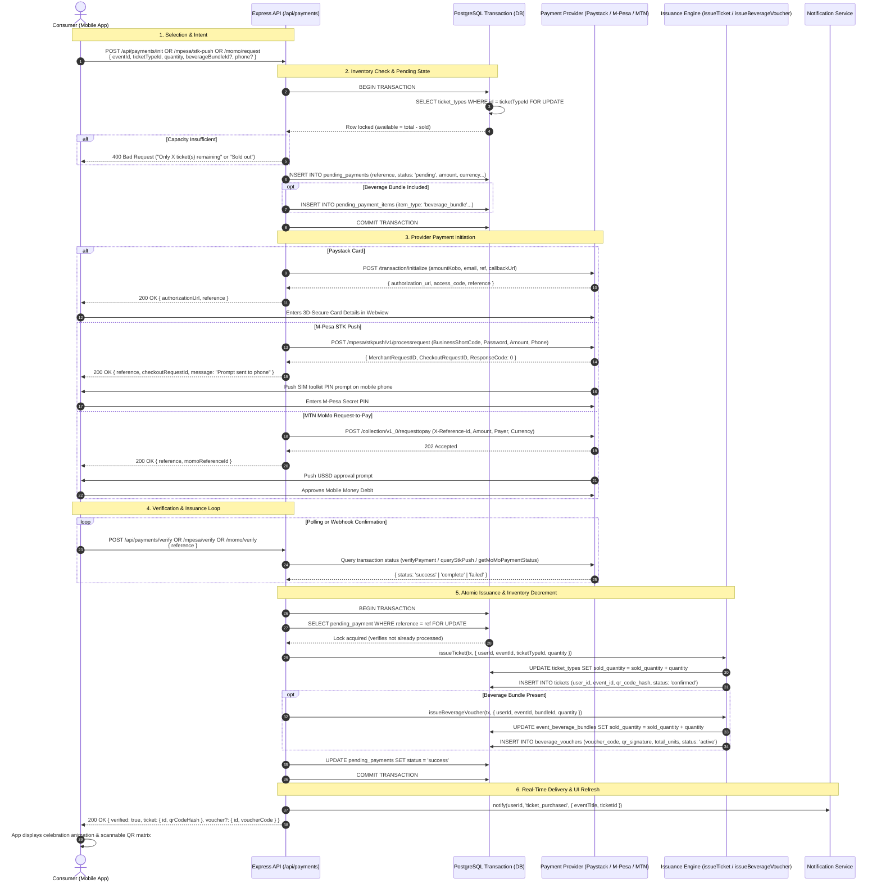

# Ticket & Drink Pass Checkout Sequence

```mermaid
sequenceDiagram
    autonumber
    actor Buyer as Consumer (Mobile App)
    participant API as Express API (/api/payments)
    participant Lock as PostgreSQL Transaction (DB)
    participant Gateway as Payment Provider (Paystack / M-Pesa / MTN)
    participant Engine as Issuance Engine (issueTicket / issueBeverageVoucher)
    participant Notification as Notification Service

    Note over Buyer,API: 1. Selection & Intent
    Buyer->>API: POST /api/payments/init OR /mpesa/stk-push OR /momo/request<br/>{ eventId, ticketTypeId, quantity, beverageBundleId?, phone? }
    
    Note over API,Lock: 2. Inventory Check & Pending State
    API->>Lock: BEGIN TRANSACTION
    Lock->>Lock: SELECT ticket_types WHERE id = ticketTypeId FOR UPDATE
    Lock-->>API: Row locked (available = total - sold)
    alt Capacity Insufficient
        API-->>Buyer: 400 Bad Request ("Only X ticket(s) remaining" or "Sold out")
    end

    API->>Lock: INSERT INTO pending_payments (reference, status: 'pending', amount, currency...)
    opt Beverage Bundle Included
        API->>Lock: INSERT INTO pending_payment_items (item_type: 'beverage_bundle'...)
    end
    API->>Lock: COMMIT TRANSACTION

    Note over API,Gateway: 3. Provider Payment Initiation
    alt Paystack Card
        API->>Gateway: POST /transaction/initialize (amountKobo, email, ref, callbackUrl)
        Gateway-->>API: { authorization_url, access_code, reference }
        API-->>Buyer: 200 OK { authorizationUrl, reference }
        Buyer->>Gateway: Enters 3D-Secure Card Details in Webview
    else M-Pesa STK Push
        API->>Gateway: POST /mpesa/stkpush/v1/processrequest (BusinessShortCode, Password, Amount, Phone)
        Gateway-->>API: { MerchantRequestID, CheckoutRequestID, ResponseCode: 0 }
        API-->>Buyer: 200 OK { reference, checkoutRequestId, message: "Prompt sent to phone" }
        Gateway->>Buyer: Push SIM toolkit PIN prompt on mobile phone
        Buyer->>Gateway: Enters M-Pesa Secret PIN
    else MTN MoMo Request-to-Pay
        API->>Gateway: POST /collection/v1_0/requesttopay (X-Reference-Id, Amount, Payer, Currency)
        Gateway-->>API: 202 Accepted
        API-->>Buyer: 200 OK { reference, momoReferenceId }
        Gateway->>Buyer: Push USSD approval prompt
        Buyer->>Gateway: Approves Mobile Money Debit
    end

    Note over Buyer,API: 4. Verification & Issuance Loop
    loop Polling or Webhook Confirmation
        Buyer->>API: POST /api/payments/verify OR /mpesa/verify OR /momo/verify<br/>{ reference }
        API->>Gateway: Query transaction status (verifyPayment / queryStkPush / getMoMoPaymentStatus)
        Gateway-->>API: { status: 'success' | 'complete' | 'failed' }
    end

    Note over API,Engine: 5. Atomic Issuance & Inventory Decrement
    API->>Lock: BEGIN TRANSACTION
    API->>Lock: SELECT pending_payment WHERE reference = ref FOR UPDATE
    Lock-->>API: Lock acquired (verifies not already processed)
    
    API->>Engine: issueTicket(tx, { userId, eventId, ticketTypeId, quantity })
    Engine->>Lock: UPDATE ticket_types SET sold_quantity = sold_quantity + quantity
    Engine->>Lock: INSERT INTO tickets (user_id, event_id, qr_code_hash, status: 'confirmed')
    
    opt Beverage Bundle Present
        API->>Engine: issueBeverageVoucher(tx, { userId, eventId, bundleId, quantity })
        Engine->>Lock: UPDATE event_beverage_bundles SET sold_quantity = sold_quantity + quantity
        Engine->>Lock: INSERT INTO beverage_vouchers (voucher_code, qr_signature, total_units, status: 'active')
    end

    API->>Lock: UPDATE pending_payments SET status = 'success'
    API->>Lock: COMMIT TRANSACTION

    Note over API,Notification: 6. Real-Time Delivery & UI Refresh
    API->>Notification: notify(userId, 'ticket_purchased', { eventTitle, ticketId })
    API-->>Buyer: 200 OK { verified: true, ticket: { id, qrCodeHash }, voucher?: { id, voucherCode } }
    Buyer->>Buyer: App displays celebration animation & scannable QR matrix
```
