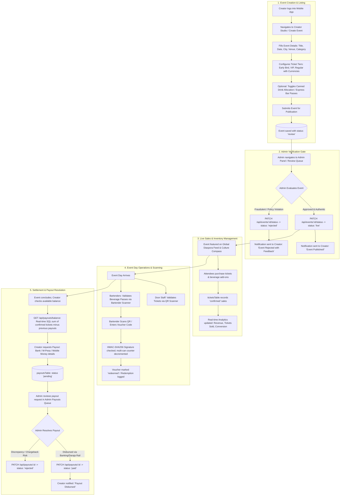

# Creator & Organizer Lifecycle Workflow

```mermaid
flowchart TD
    subgraph CreatorCreation["1. Event Creation & Listing"]
        A[Creator logs into Mobile App] --> B[Navigates to Creator Studio / Create Event]
        B --> C[Fills Event Details: Title, Date, City, Venue, Category]
        C --> D[Configures Ticket Tiers: Early Bird, VIP, Regular with Currencies]
        D --> E[Optional: Toggles Canned Drink Allocation / Express Bar Passes]
        E --> F[Submits Event for Publication]
        F --> G[(Event saved with status: 'review')]
    end

    subgraph AdminModeration["2. Admin Verification Gate"]
        G --> H[Admin navigates to Admin Panel / Review Queue]
        H --> I{Admin Evaluates Event}
        I -->|Approved & Authentic| J[PATCH /api/events/:id/status -> status: 'live']
        I -->|Fraudulent / Policy Violation| K[PATCH /api/events/:id/status -> status: 'rejected']
        J --> L[Notification sent to Creator: 'Event Published!']
        K --> M[Notification sent to Creator: 'Event Rejected with Feedback']
    end

    subgraph LiveSales["3. Live Sales & Inventory Management"]
        J --> N[Event featured on Global Diaspora Feed & Culture Compass]
        N --> O[Attendees purchase tickets & beverage add-ons]
        O --> P[ticketsTable records 'confirmed' sales]
        P --> Q[Real-time Analytics updated: Revenue, Tickets Sold, Conversion]
    end

    subgraph EventOperations["4. Event Day Operations & Scanning"]
        N --> R[Event Day Arrives]
        R --> S[Door Staff: Validates Tickets via QR Scanner]
        R --> T[Bartenders: Validates Beverage Passes via Bartender Scanner]
        T --> U[Bartender Scans QR / Enters Voucher Code]
        U --> V[HMAC-SHA256 Signature checked; multi-can counter decremented]
        V --> W[Voucher marked 'redeemed' / Redemption logged]
    end

    subgraph FinancialSettlement["5. Settlement & Payout Resolution"]
        R --> X[Event concludes; Creator checks available balance]
        X --> Y[GET /api/payouts/balance: Real-time SQL sum of confirmed tickets minus previous payouts]
        Y --> Z[Creator requests Payout: Bank / M-Pesa / Mobile Money details]
        Z --> AA[(payoutsTable: status 'pending')]
        AA --> AB[Admin reviews payout request in Admin Payouts Queue]
        AB --> AC{Admin Resolves Payout}
        AC -->|Disbursed via Banking/Daraja Rail| AD[PATCH /api/payouts/:id -> status: 'paid']
        AC -->|Discrepancy / Chargeback Risk| AE[PATCH /api/payouts/:id -> status: 'rejected']
        AD --> AF[Creator notified: 'Payout Disbursed']
    end
```
