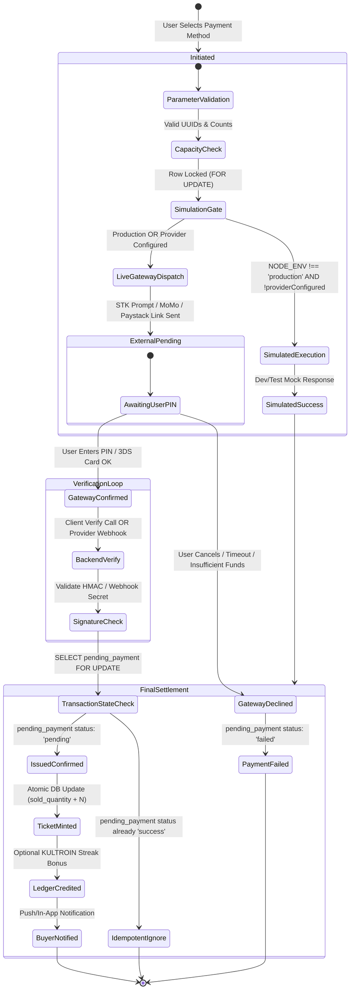

# Payment Lifecycle & State Machine

```mermaid
stateDiagram-v2
    [*] --> Initiated: User Selects Payment Method

    state Initiated {
        [*] --> ParameterValidation
        ParameterValidation --> CapacityCheck: Valid UUIDs & Counts
        CapacityCheck --> SimulationGate: Row Locked (FOR UPDATE)
        
        state SimulationGate <<choice>>
        SimulationGate --> SimulatedExecution: NODE_ENV !== 'production' AND !providerConfigured
        SimulationGate --> LiveGatewayDispatch: Production OR Provider Configured
        
        SimulatedExecution --> SimulatedSuccess: Dev/Test Mock Response
        LiveGatewayDispatch --> ExternalPending: STK Prompt / MoMo / Paystack Link Sent
    }

    state ExternalPending {
        [*] --> AwaitingUserPIN
        AwaitingUserPIN --> GatewayConfirmed: User Enters PIN / 3DS Card OK
        AwaitingUserPIN --> GatewayDeclined: User Cancels / Timeout / Insufficient Funds
    }

    state VerificationLoop {
        GatewayConfirmed --> BackendVerify: Client Verify Call OR Provider Webhook
        BackendVerify --> SignatureCheck: Validate HMAC / Webhook Secret
        SignatureCheck --> TransactionStateCheck: SELECT pending_payment FOR UPDATE
    }

    state FinalSettlement {
        TransactionStateCheck --> IssuedConfirmed: pending_payment status: 'pending'
        IssuedConfirmed --> TicketMinted: Atomic DB Update (sold_quantity + N)
        TicketMinted --> LedgerCredited: Optional KULTROIN Streak Bonus
        LedgerCredited --> BuyerNotified: Push/In-App Notification
        
        TransactionStateCheck --> IdempotentIgnore: pending_payment status already 'success'
        GatewayDeclined --> PaymentFailed: pending_payment status: 'failed'
    }

    SimulatedSuccess --> FinalSettlement
    BuyerNotified --> [*]
    IdempotentIgnore --> [*]
    PaymentFailed --> [*]
```
